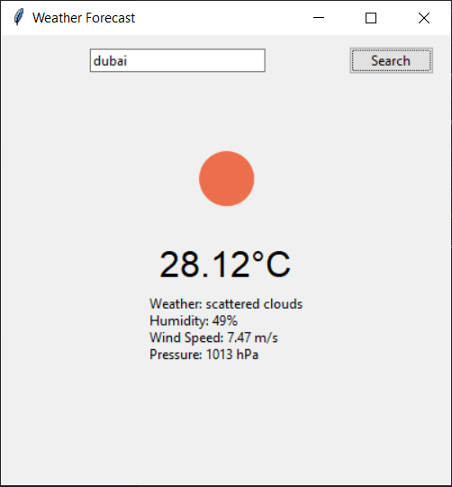
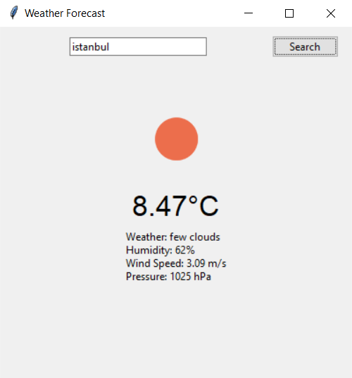

# ⛅ Weather Forecast GUI App

A desktop application that displays current weather conditions using OpenWeatherMap API.




## 🌟 Features
- Search weather by city name
- Displays temperature, humidity, wind speed, and pressure
- Weather condition icons
- Error handling for invalid inputs
- Responsive GUI with Tkinter

## 🛠️ Requirements
- Python 3.x
- `requests` library
- `Pillow` (for image handling)
- Tkinter (usually included with Python)

## 🚀 Usage
```bash
python weather_app.py
```
## Install dependencies:
```bash
pip install -r requirements.txt
```

## ⚙️ Installation
1. Get API key from [OpenWeatherMap](https://openweathermap.org/api)
2. Clone repository:
```bash
git clone https://github.com/Parsa-developer/weather-app.git
cd weather-app
```

## ⚠️ Important Notes
Free API tier has rate limits (60 requests/minute)
Requires active internet connection
API key must be kept private